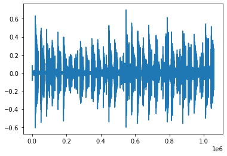
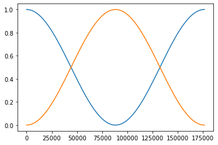
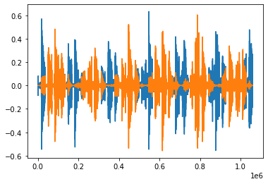

> [!IMPORTANT]  
> Listen with headphones!

[🔊 Click here to play audio 🔊](https://aljazfrancic.github.io/read-audio/?p=https://github.com/aljazfrancic/8d-audio-homebrew/raw/refs/heads/main/audio_output.wav)

# 8d-audio-homebrew
Jupyter notebook that converts a regular wav file into an 8d audio wav file.

> [!NOTE]
> "8d audio" is an effect that you can apply to your songs to make it sound like the audio is moving in circles around your head.

## Demo

 

 

